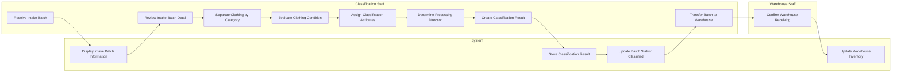

```mermaid
flowchart LR

subgraph ClassificationStaff[Classification Staff]
    C1[Receive Intake Batch]
    C2[Review Intake Batch Detail]
    C3[Separate Clothing by Category]
    C4[Evaluate Clothing Condition]
    C5[Assign Classification Attributes]
    C6[Determine Processing Direction]
    C7[Create Classification Result]
    C8[Transfer Batch to Warehouse]
end

subgraph System
    S1[Display Intake Batch Information]
    S2[Store Classification Result]
    S3[Update Batch Status: Classified]
    S4[Update Warehouse Inventory]
end

subgraph WarehouseStaff[Warehouse Staff]
    W1[Confirm Warehouse Receiving]
end

C1 --> S1
S1 --> C2
C2 --> C3
C3 --> C4
C4 --> C5
C5 --> C6
C6 --> C7
C7 --> S2
S2 --> S3
S3 --> C8
C8 --> W1
W1 --> S4
```