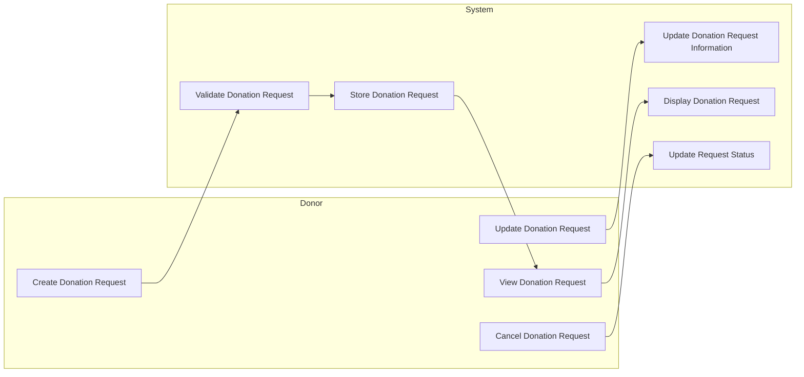

```mermaid
flowchart LR

subgraph Donor
    D1[Create Donation Request]
    D2[Update Donation Request]
    D3[View Donation Request]
    D4[Cancel Donation Request]
end

subgraph System
    S1[Validate Donation Request]
    S2[Store Donation Request]
    S3[Update Donation Request Information]
    S4[Display Donation Request]
    S5[Update Request Status]
end

D1 --> S1
S1 --> S2
S2 --> D3
D3 --> S4
D2 --> S3
D4 --> S5
```