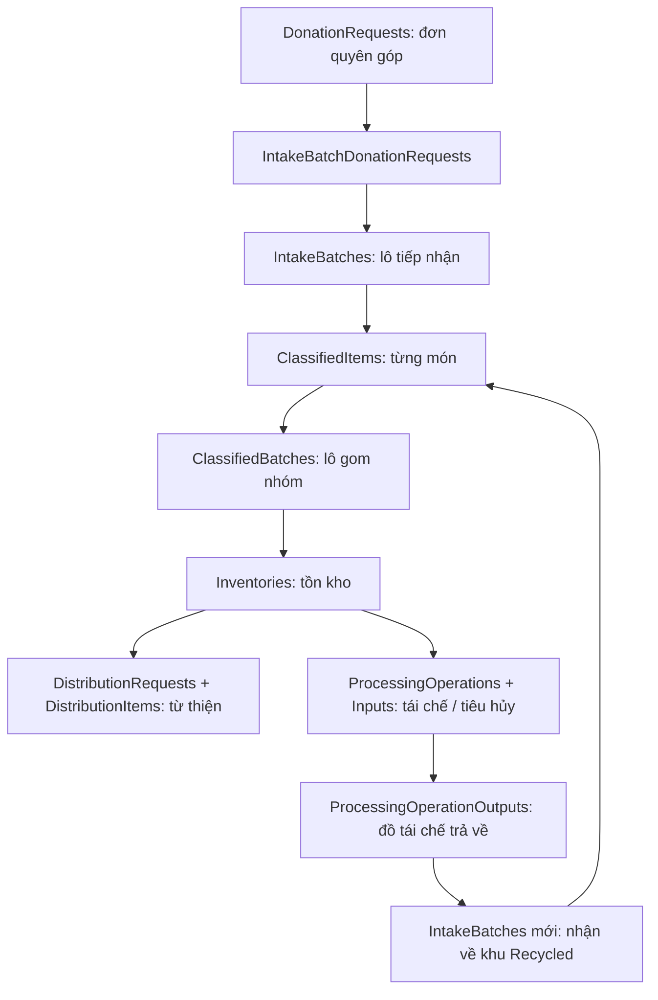
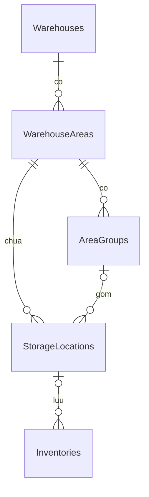

# Hướng dẫn các bảng và luồng dữ liệu ReThreads

**Đối chiếu ngày 10/09/2026** với database SQL Server local `UsedClothingDb`, các model trong `src/DAL/Models`, cấu hình `AppDbContext` và service đang triển khai trong workspace.

Tài liệu này dùng để học hệ thống **hiện tại**, bao gồm các thay đổi local về tái chế trả về, phân loại tiếp từ ca trước và cấu hình mục đích khu. Không mặc định rằng các thay đổi này đã được deploy lên môi trường khác. Các trường bên dưới là trường tiêu biểu, không phải bản liệt kê mọi cột SQL.

## 1. Nên học theo thứ tự nào?

1. Hiểu bốn khái niệm: **đơn quyên góp → lô tiếp nhận → món đã phân loại → lô gom nhóm/tồn kho**.
2. Hiểu cấu trúc **kho → khu → dãy → vị trí** và **ca → team → thành viên**.
3. Theo dõi flow từ thiện trước, rồi flow tái chế/tiêu hủy.
4. Theo dõi đồ tái chế trả về: đây là một lượt tiếp nhận và phân loại mới.
5. Cuối cùng đọc các bảng điểm thưởng, voucher, thông báo và cấu hình.

### Những khái niệm dễ nhầm

| Khái niệm | Bảng chính | Một dòng đại diện cho điều gì? |
|---|---|---|
| Đơn quyên góp, mã DR | `DonationRequests` | Một lần donor yêu cầu quyên góp, có liên hệ và cách giao/nhận |
| Lô tiếp nhận, thường mã INT | `IntakeBatches` | Một lô được bộ phận tiếp nhận/quản lý vận hành đưa vào xử lý; có thể chứa hàng từ nhiều DR |
| Món đã phân loại, mã CI | `ClassifiedItems` | Một vật phẩm được nhân viên đánh giá, gán thuộc tính và nhãn A/B/C |
| Lô gom nhóm, mã CB | `ClassifiedBatches` | Một nhóm vật phẩm có tiêu chí gom nhóm phù hợp, được xếp khu rồi bàn giao kho |
| Tồn kho, mã SKU | `Inventories` | Số dư hàng của một bản ghi tồn kho, kèm batch nguồn, vị trí và phần giữ chỗ |
| Phiếu nhập/xuất/điều chuyển | `InventoryTransactions` + `TransactionItems` | Một lần biến động tồn kho và các dòng chi tiết trước/sau |

**Ví dụ giả định:** hai đơn DR được đưa vào một INT. Nhân viên phân loại các món trong INT thành CI. Một số CI nhãn A vào CB-A, các CI nhãn B vào CB-B. Sau khi kho tiếp nhận và xếp vị trí, hàng trở thành tồn kho để phục vụ yêu cầu từ thiện hoặc tái chế. Các mã trong ví dụ chỉ để minh họa.



Sơ đồ thể hiện đường đi nghiệp vụ; mũi tên không có nghĩa tất cả các cặp bảng đều có FK trực tiếp.

## 2. Quy ước chung khi đọc database

- Các entity nghiệp vụ kế thừa `BaseEntity`: `Id`, `CreateAt`, `UpdateAt`, `DeleteAt`, `CreatedBy`, `UpdatedBy`, `DeletedBy`, `IsActive`. `BaseEntity` không phải một bảng riêng.
- `Id` thường là GUID/SQL `uniqueidentifier`; mã DR/INT/CB/SKU là mã đọc được trên giao diện. Khi JOIN nên dùng ID, không tách chuỗi mã để suy ra quan hệ.
- Nhiều thao tác xóa là **xóa mềm**, tức `IsActive=false` và ghi thông tin xóa. Khi xem dữ liệu nghiệp vụ đang hoạt động, nhiều service dùng điều kiện `IsActive != false`, bao gồm cả dữ liệu legacy có giá trị NULL.
- `CreatedBy`/`UpdatedBy` là thông tin audit; không nên mặc định mọi trường có hậu tố `Id` đều có FK vật lý. Quan hệ cụ thể được khai báo trong `AppDbContext` và migration.
- `RowVersion` ở một số bảng là token SQL Server dùng phát hiện cập nhật đồng thời, không phải thời điểm cập nhật. Ví dụ: `Inventories`, `ProcessingOperations`, `IntakeBatches`, `ClassifiedBatches`, `Warehouses`, `WarehouseAreas`, `StorageLocations`.
- Khối lượng trong nghiệp vụ thường là **kg**. Khi gửi GHN, service đổi sang **gram**. Số lượng món và khối lượng là hai đại lượng riêng; có flow xử lý chủ yếu theo kg.
- Nhiều trạng thái lưu bằng chuỗi. Không dùng trạng thái của bảng này để suy ra trạng thái của bảng khác: `ClassifiedBatches.Status` khác `IntakeBatches.Status`, và `ProcessingOperations.Status` khác `GhnStatus`.
- `AppDbContext.SaveChanges` chuyển các timestamp UTC sang giờ Việt Nam trước khi lưu. Khi đọc SQL trực tiếp, không mặc định mọi cột thời gian là UTC hoặc cộng thêm 7 giờ lần nữa.
- `ImageUrls`/`BatchImages` là danh sách đường dẫn ảnh trong model, không có bảng ảnh độc lập trong danh sách bảng hiện tại.

## 3. Nhóm tài khoản và phân quyền

### `Roles`

- **Công dụng:** danh mục vai trò dùng phân quyền.
- **Dữ liệu:** `RoleName`, `Description`; ví dụ Manager, ReceivingStaff, ClassificationStaff, WarehouseStaff, CharityOrganization, RecyclingOrganization, DisposalOrganization, Donor.
- **Liên kết:** một role có nhiều `Users`, qua `Users.RoleId`.
- **Flow:** đăng nhập, kiểm tra quyền gọi API, quản lý tài khoản và mọi màn hình theo vai trò.

### `Users`

- **Công dụng:** tài khoản chung cho donor, nhân viên, manager và các tổ chức.
- **Dữ liệu:** `UserName`, `FullName`, email, điện thoại, địa chỉ, `PasswordHash`, `RoleId`, `WarehouseId`, `UserStatus`, `EmailConfirmed`, số dư `DonationPoint`.
- **Liên kết:** role; kho được phân công cho nhân viên; các đơn, thao tác, thông báo và giao dịch điểm liên quan đến người dùng.
- **Flow:** toàn hệ thống. Tổ chức tái chế/tiêu hủy là user có role tương ứng, **không có bảng Organizations riêng** trong schema hiện tại.
- **Cần nhớ:** `PasswordHash` không phải mật khẩu gốc. Không đưa hash, mã xác minh hoặc thông tin đăng nhập thật vào tài liệu học.

### `UserVerificationCodes`

- **Công dụng:** lưu mã xác minh cho tài khoản và khôi phục mật khẩu theo `Purpose`.
- **Dữ liệu:** `UserId`, `CodeHash`, `Purpose`, `ExpiresAt`, `VerifiedAt`, `FailedAttempts`.
- **Liên kết:** nhiều mã có thể thuộc một user.
- **Flow:** đăng ký/xác minh, gửi lại mã, đặt lại mật khẩu; không phải bảng lưu phiên đăng nhập.

## 4. Nhóm kho, khu, dãy và vị trí



### `Warehouses`

- **Công dụng:** thông tin kho và giới hạn sức chứa tổng.
- **Dữ liệu:** tên kho, địa chỉ, điện thoại/email, `TotalCapacityKg`, `CurrentWeight`, tọa độ và `ServiceRadiusKm`.
- **Liên kết:** khu, nhân viên, ca, lô tiếp nhận, tồn kho, yêu cầu phân phối/xử lý.
- **Flow:** manager cấu hình kho, lựa chọn kho phục vụ donor, tiếp nhận, phân loại, nhập/xuất và GHN lấy hàng.

### `WarehouseAreas`

- **Công dụng:** một khu chức năng bên trong kho.
- **Dữ liệu:** `WarehouseId`, `AreaName`, `AreaType`, `ProcessingDirection`, `CapacityKg`, `CurrentKg`, mô tả.
- **Liên kết:** dãy `AreaGroups`, vị trí `StorageLocations`, vị trí hiện tại của lô tiếp nhận/gom nhóm.
- **Flow:** tất cả các bước xếp khu; manager tạo/sửa mục đích và sức chứa khu.

| `AreaType` | `ProcessingDirection` | Ý nghĩa |
|---|---|---|
| `Receiving` | Thường NULL | Khu tiếp nhận hàng đầu vào |
| `Unclassified` | NULL | Khu chờ phân loại |
| `Classified` | NULL | Khu xếp batch đã phân loại, trước bàn giao kho |
| `Recycled` | NULL | Đồ tổ chức tái chế trả về, chờ phân loại lại |
| `Storage` | `Charity` | Lưu đồ từ thiện, nhãn A |
| `Storage` | `Recycling` | Lưu đồ chờ gửi tái chế, nhãn B |
| `Storage` | `Disposal` | Lưu đồ cách ly/tiêu hủy, nhãn C |
| `Storage` | NULL | Khu lưu kho đa mục đích; cấu hình hướng xử lý ở từng vị trí |

**Phân biệt:** khu `Storage/Recycling` chứa đồ **sắp gửi đi** tái chế; khu `Recycled` chứa đồ **đã tái chế trả về**. Không thay thế hai loại khu này cho nhau.

### `AreaGroups`

- **Công dụng:** dãy/nhóm vị trí thuộc một khu.
- **Dữ liệu:** `AreaId`, `GroupName`, mô tả, `CapacityKg`, `CurrentKg`.
- **Liên kết:** `WarehouseAreas` → `AreaGroups` → `StorageLocations`; tồn kho có thể tham chiếu `AreaGroupId`.
- **Flow:** chọn khu → dãy → vị trí khi xếp hàng; kiểm tra sức chứa ở cấp dãy.
- **Cần nhớ:** đây là nhóm **vị trí vật lý**, không phải nhóm vật phẩm `ClassifiedBatches`.

### `StorageLocations`

- **Công dụng:** vị trí vật lý cụ thể trong kho.
- **Dữ liệu:** `WarehouseId`, `AreaId`, `AreaGroupId`, `LocationCode`, `AisleCode`, `RackCode`, `ShelfCode`, `BinCode`, sức chứa, trọng lượng hiện tại, `Status`, `PreferredProcessingDirection`, `PreferredGarmentGroup`.
- **Liên kết:** khu, dãy, inventory; lô tiếp nhận/gom nhóm và dòng giao dịch nguồn/đích có thể chỉ tới vị trí này.
- **Flow:** xếp batch vào khu, putaway, điều chuyển, nhận đồ tái chế trả về.
- **Cần nhớ:** không có bảng Rack/Shelf/Bin riêng; các cấp mã này nằm trong bản ghi vị trí. Với khu có hướng xử lý cố định, vị trí mới kế thừa hướng đó và API chặn cấu hình không khớp.

## 5. Nhóm lịch làm việc và phân công nhân sự

### `WorkScheduleTemplates`

- **Công dụng:** mẫu lịch làm việc của một kho theo năm.
- **Dữ liệu:** `WarehouseId`, `Year`, `WorkingDays`, giờ bắt đầu/kết thúc buổi sáng và chiều.
- **Liên kết:** kho; có ràng buộc duy nhất theo kho/năm.
- **Flow:** cấu hình lịch, tạo và quản lý ca. Mẫu lịch và ca thực tế không phải cùng một bản ghi.

### `Shifts`

- **Công dụng:** ca làm việc thực tế của kho trong một ngày.
- **Dữ liệu:** `WarehouseId`, `ShiftName`, `ShiftDate`, `StartTime`, `EndTime`, `Status`, `StartedAt`, `CompletedAt`.
- **Liên kết:** kho, team, lô tiếp nhận và phân công lấy hàng.
- **Flow:** bắt đầu/kết thúc ca, điều phối nhận hàng, phân loại, nhận đồ tái chế trả về.

### `OperationalTeams`

- **Công dụng:** team vận hành trong một ca.
- **Dữ liệu:** `ShiftId`, `TeamType`, `TeamName`, `Status`, thời điểm và người bắt đầu/kết thúc.
- **Liên kết:** ca, thành viên; được tham chiếu bởi batch và phân công pickup.
- **Flow:** tạo team tiếp nhận/phân loại, gán nhiệm vụ, theo dõi tiến độ ca.

### `TeamMembers`

- **Công dụng:** bảng nối team với tài khoản nhân viên.
- **Dữ liệu:** `TeamId`, `StaffId` và các cột audit.
- **Liên kết:** `OperationalTeams` ↔ `Users`.
- **Flow:** kiểm tra nhân viên có thuộc team được giao batch hay không; phân công và tiếp tục việc từ ca trước.

### `PickupAssignments`

- **Công dụng:** phân công một đơn quyên góp cho ca/team đi nhận hàng, gắn vào lô tiếp nhận.
- **Dữ liệu:** `DonorRequestId`, `ShiftId`, `TeamId`, `IntakeBatchId`, `RouteOrder`, `AreaKey`, trạng thái, thời điểm xử lý, ghi chú.
- **Liên kết:** `DonorRequestId` trỏ tới **DonationRequests** dù tên cột dùng chữ “Donor”; thêm ca, team, INT.
- **Flow:** manager điều phối tuyến lấy hàng → nhân viên đi nhận → cập nhật kết quả.

### `ClassificationBatchTransfers`

- **Công dụng:** lịch sử chuyển công việc phân loại chưa xong từ team/ca cũ sang team hiện tại.
- **Dữ liệu:** `IntakeBatchId`, `FromTeamId`, `ToTeamId`, `StaffId`, `TransferredAt`.
- **Liên kết:** INT, hai team và người thực hiện.
- **Flow:** “Tiếp tục từ ca trước”. Cập nhật team xử lý hiện tại trên INT nhưng vẫn giữ lịch sử và kết quả đã kiểm đếm/phân loại.
- **Cần nhớ:** đây là chuyển **trách nhiệm công việc**, không phải phiếu di chuyển hàng giữa vị trí kho.

## 6. Nhóm quyên góp và tiếp nhận đầu vào

### `DonationRequests`

- **Công dụng:** đơn quyên góp do donor gửi vào hệ thống.
- **Dữ liệu:** `RequestCode`, `DonorId`, `WarehouseId`, người liên hệ, điện thoại, `DeliveryMethod`, `DropOffMethod`, địa chỉ/ngày lấy hàng, ảnh, mô tả, `EstimateWeight`, `ActualWeight`, trạng thái và lý do từ chối. Có thông tin hãng vận chuyển/mã theo dõi nếu phù hợp phương thức giao.
- **Liên kết:** donor, kho, pickup assignment, INT qua bảng nối, nguồn CB, chat, thông báo và điểm thưởng.
- **Flow:** donor tạo yêu cầu → phân công/nhận trực tiếp → xác nhận nhận hàng → theo dõi xử lý nguồn quyên góp.

### `IntakeBatches`

- **Công dụng:** hồ sơ lô tiếp nhận và tiến độ phân loại đầu vào.
- **Dữ liệu:** mã lô, kho/ca, team tiếp nhận và team phân loại, ngày/khối lượng, ảnh lô, trạng thái, vị trí khu/dãy/vị trí hiện tại.
- **Dữ liệu tiến độ:** thời điểm giao phân loại, manager phân công, nhân viên nhận, số món/khối lượng kiểm đếm, ghi chú chênh lệch, bắt đầu/kết thúc phân loại.
- **Liên kết:** DR qua `IntakeBatchDonationRequests`; CI qua `ClassifiedItems.BatchId`; lịch sử đổi team; `ProcessingOperationOutputId` nếu là lô đồ tái chế trả về.
- **Flow:** nhận đầu vào, manager giao team, đếm món, phân loại từng món; hoặc nhận đồ tái chế về và phân loại lại.
- **Cần nhớ:** cùng bảng chứa cả INT thông thường và lô trả về có mã `RC-...`. Đừng giả định mỗi INT đều có DR trực tiếp.

### `IntakeBatchDonationRequests`

- **Công dụng:** xác định lô tiếp nhận chứa hàng từ những đơn quyên góp nào.
- **Dữ liệu:** `IntakeBatchId`, `DonationRequestId`, `AddedAt`, `AddedByStaffId`.
- **Liên kết:** bảng nối giữa INT và DR.
- **Flow:** gom đơn vào lô tiếp nhận, mở chi tiết nguồn hàng, truy vết donor.
- **Ví dụ:** một INT chứa hàng của DR-01 và DR-02 sẽ có hai dòng nối tương ứng.

## 7. Nhóm tiêu chí và kết quả phân loại

### `Categories`

- **Công dụng:** danh mục thuộc tính và nhãn dùng trong phân loại.
- **Dữ liệu:** `Code`, `Name`, `Type`, `ParentId`, `SortOrder`, mô tả, `MinimumMatchCount`.
- **Liên kết:** quan hệ cha/con trong cùng bảng; các trường `FabricTypeId`, `GarmentGroupId`, `ClothingTypeId`, `GenderId`, `TargetUserId`, `SizeId`, `ConditionGradeId` trên CI/CB/inventory.
- **Flow:** cấu hình danh mục, chọn thuộc tính món, đánh giá nhãn, gom nhóm và lọc tồn kho.
- **Cần nhớ:** các tên thuộc tính còn được lưu trực tiếp trên CI/CB/inventory để phục vụ hiển thị; không chỉ có ID danh mục.

### `ConditionQuestions`

- **Công dụng:** bộ câu hỏi kiểm tra tình trạng quần áo.
- **Dữ liệu:** `QuestionText`, `DisplayOrder`.
- **Liên kết:** một câu hỏi có nhiều `ConditionAnswers`; kết quả chọn nằm ở `InspectionAnswers`.
- **Flow:** manager cấu hình tiêu chí → nhân viên trả lời khi phân loại món.

### `ConditionAnswers`

- **Công dụng:** các đáp án cấu hình sẵn của một câu hỏi.
- **Dữ liệu:** `ConditionQuestionId`, `AnswerText`, `ConditionRating`.
- **Liên kết:** câu hỏi và các lần lựa chọn đáp án trong `InspectionAnswers`.
- **Flow:** chấm tình trạng. Mức số 1/2/3 tương ứng nhãn A/B/C trong flow hiện tại.

### `InspectionAnswers`

- **Công dụng:** lưu nhân viên đã chọn đáp án nào cho từng câu hỏi trên một món cụ thể.
- **Dữ liệu:** `ClassifiedItemId`, `ConditionQuestionId`, `ConditionAnswerId`.
- **Liên kết:** CI + câu hỏi + đáp án.
- **Flow:** tạo/sửa kết quả phân loại, kiểm tra lại cơ sở đánh giá món.
- **Cần nhớ:** `ConditionAnswers` là danh mục đáp án; `InspectionAnswers` là đáp án đã chọn trong một lần đánh giá vật phẩm.

### `ClassifiedItems`

- **Công dụng:** hồ sơ từng món sau đánh giá phân loại.
- **Dữ liệu:** `ItemCode`, ID/tên thuộc tính, `ConditionRating`, `ProcessingDirection`, ảnh, ghi chú, `ClassifiedByStaffId`, `ClassifiedAt`, `Status`.
- **Liên kết:** `BatchId` là ID của **IntakeBatches**; `ClassifiedBatchId` là CB mà món được gom vào, có thể NULL; kèm câu trả lời kiểm tra.
- **Flow:** phân loại từng món → chờ gom nhóm → thêm vào CB. Bỏ món khỏi nhóm hoặc xóa nhóm nháp có thể trả `ClassifiedBatchId` về NULL, không cần tạo lại món.

### `ClassifiedBatches`

- **Công dụng:** nhóm các món đã phân loại để xếp khu, bàn giao kho và quản lý tồn.
- **Dữ liệu:** `BatchCode`, `GroupKey`, ngày phân loại, thuộc tính nhóm/nhãn/hướng xử lý, tổng món/khối lượng, trạng thái, vị trí và các mốc xếp khu/bàn giao/nhận kho/putaway.
- **Liên kết:** nhiều CI, nguồn DR qua `ClassifiedBatchDonationRequests`, vị trí kho, inventory. Model còn có `ProcessingOperationOutputId`; flow tái chế trả về hiện tại đi qua **IntakeBatches mới** để phân loại lại trước.
- **Flow:** tạo nhóm → thêm món → hoàn tất nhóm → xếp khu đã phân loại → gửi kho → kho nhận → xếp tồn kho.
- **Cần nhớ:** batch có ngày cũ vẫn có thể đang nằm trong khu hôm nay. Ngày phân loại không phải điều kiện để kết luận hàng đã ra khỏi khu.

### `ClassifiedBatchDonationRequests`

- **Công dụng:** lưu nguồn quyên góp của CB để truy vết sau khi món từ INT được gom nhóm.
- **Dữ liệu:** `ClassifiedBatchId`, `DonationRequestId`, `IntakeBatchId`, `LinkedAt`.
- **Liên kết:** CB, DR và INT nguồn.
- **Flow:** xem “Nguồn Donation Request”, thông báo donor khi hàng được xử lý/xuất và truy vết tồn kho.
- **Cần nhớ:** CB có thể gom món từ nhiều nguồn; một trường `DonationRequestId` duy nhất trên CB không đủ biểu diễn quan hệ này.

## 8. Nhóm tồn kho và phiếu biến động

### `Inventories`

- **Công dụng:** số dư tồn hiện tại theo bản ghi SKU/batch/vị trí.
- **Dữ liệu:** `Sku`, `ClassifiedBatchId`, kho/dãy/vị trí, thuộc tính/nhãn/hướng xử lý, `Quantity`, `TotalWeight`, `ReservedQuantity`, `ReservedWeight`, `Status`.
- **Liên kết:** CB nguồn, vị trí, dòng yêu cầu phân phối/xử lý, dòng giao dịch tồn.
- **Flow:** nhập kho, xếp vị trí, giữ chỗ cho yêu cầu được duyệt, xuất hàng, điều chuyển.
- **Cách đọc:** khối lượng khả dụng = `TotalWeight - ReservedWeight`. Giữ chỗ không đồng nghĩa đã xuất. Sau xuất hết, bản ghi có thể còn trong DB với trạng thái `Depleted` và khối lượng bằng 0.

### `InventoryTransactions`

- **Công dụng:** phần đầu phiếu ghi một lần biến động kho.
- **Dữ liệu:** `TransactionCode`, `TransactionType`, `WarehouseId`, `ReferenceType`, `ReferenceId`, trạng thái, ghi chú, người và thời điểm thực hiện.
- **Liên kết:** nhiều `TransactionItems`; `ReferenceType` + `ReferenceId` cho biết chứng từ/nghiệp vụ nguồn, ví dụ DistributionRequest hoặc ProcessingOperation.
- **Flow:** nhập (`IN`), xuất (`OUT`), điều chuyển (`MOVE`) trong các service kho.
- **Cần nhớ:** tham chiếu loại + ID là liên kết nghiệp vụ đa loại, không phải một FK SQL duy nhất tới mọi bảng yêu cầu.

### `TransactionItems`

- **Công dụng:** từng dòng chi tiết của phiếu biến động tồn.
- **Dữ liệu:** `TransactionId`, `InventoryId`, `ClassifiedBatchId`, số lượng/khối lượng thao tác, `QuantityBefore/After`, `WeightBefore/After`, vị trí nguồn/đích, ghi chú.
- **Liên kết:** phiếu đầu, inventory, CB, vị trí.
- **Flow:** giải thích vì sao tồn tăng/giảm và hàng được chuyển từ đâu tới đâu.
- **Ví dụ:** muốn biết 13 kg xuất cho yêu cầu nào, tìm phiếu `OUT` theo `ReferenceId`, rồi xem các dòng và số dư trước/sau tại bảng này.

## 9. Nhóm phân phối từ thiện và GHN

### `DistributionRequests`

- **Công dụng:** yêu cầu phân phối trong luồng từ thiện hiện tại.
- **Dữ liệu:** mã yêu cầu, `UserId` của tổ chức, kho, địa chỉ/người/số điện thoại nhận, trạng thái, ghi chú, phản hồi duyệt, thời điểm/người xuất, `IssueSlipCode`; thông tin hãng vận chuyển, phí, mã và trạng thái GHN.
- **Liên kết:** tổ chức trong `Users`, kho, `DistributionItems`, `ShipmentStatusHistories`; phiếu OUT liên kết bằng reference.
- **Flow:** tổ chức xin hàng hoặc manager đề xuất → các bên phản hồi/duyệt → kho tạo phiếu xuất → tạo vận đơn GHN → theo dõi giao hàng.

### `DistributionItems`

- **Công dụng:** các dòng tồn kho được yêu cầu phân phối.
- **Dữ liệu:** `DistributionRequestId`, `InventoryId`, nhãn, số lượng yêu cầu/duyệt/xuất, `RequestedWeight`, `IssuedWeight`, ghi chú.
- **Liên kết:** đầu yêu cầu và inventory.
- **Flow:** chọn SKU, kiểm tra tồn/giữ chỗ, ghi thực xuất. Trong flow phân phối hiện tại, khối lượng là dữ liệu quan trọng; không suy ra đã xuất bao nhiêu kg chỉ từ cột số món.

### `ShipmentStatusHistories`

- **Công dụng:** lịch sử vận chuyển của yêu cầu phân phối.
- **Dữ liệu:** `DistributionRequestId`, `Status`, `Description`, `Source`, `OccurredAt`.
- **Liên kết:** `DistributionRequests`.
- **Flow:** tạo GHN và cập nhật trạng thái giao hàng từ thiện.
- **Cần nhớ:** trạng thái GHN mới nhất nằm trên yêu cầu; các lần ghi lịch sử nằm ở đây. Bảng này không lưu lịch sử GHN của `ProcessingOperations`.

## 10. Nhóm tái chế, tiêu hủy và nhận hàng trả về

### `ProcessingOperations`

- **Công dụng:** đầu yêu cầu đưa hàng đi tái chế hoặc tiêu hủy, cùng tiến trình xử lý sau đó.
- **Dữ liệu:** `OperationCode`, `OperationType`, `WarehouseId`, `OrganizationId`, `Status`, người tạo/duyệt/xuất, các mốc phản hồi/xuất/nhận/hoàn tất, lý do từ chối, kết quả xử lý.
- **Dữ liệu vận chuyển đi:** `CarrierName`, `TrackingCode`, `GhnOrderCode`, `GhnStatus`, `GhnUpdatedAt`.
- **Dữ liệu trả về:** `ExpectedReturnDate`, `ReturnDispatchedAt`, `ReturnCarrierName`, `ReturnTrackingCode`, `ReturnNotes`, `OutputReturnedAt`.
- **Liên kết:** tổ chức trong Users, kho, inputs, outputs, lịch sử GHN và phiếu OUT qua reference.
- **Flow:** manager tạo → tổ chức đồng ý → manager duyệt → kho xuất → GHN → tổ chức nhận. Tiêu hủy ghi kết quả hoàn tất; tái chế hẹn ngày/gửi trả/kho nhận lại.
- **Cần nhớ:** lịch hẹn trả hiện nằm trên bảng này; không có bảng RecyclingAppointments riêng. Tổ chức được xác nhận thực nhận sau xuất kho mà không cần chờ GHN báo Delivered; việc đó không giả lập trạng thái GHN.

### `ProcessingOperationInputs`

- **Công dụng:** hàng đầu vào gửi cho tổ chức xử lý.
- **Dữ liệu:** `ProcessingOperationId`, `InventoryId`, `ClassifiedBatchId`, số món/khối lượng yêu cầu và thực xuất, ghi chú.
- **Liên kết:** yêu cầu xử lý, inventory và CB nguồn.
- **Flow:** chọn nguyên batch nhãn B/C, khóa lựa chọn trong yêu cầu, duyệt giữ chỗ và xuất kho. Các ràng buộc service quyết định lúc nào được chọn/duyệt/xuất, không chỉ dựa trên sự tồn tại của dòng input.

### `ProcessingOperationOutputs`

- **Công dụng:** các lô đầu ra do tổ chức tái chế khai báo gửi trả và số liệu kho thực nhận.
- **Dữ liệu:** `ProcessingOperationId`, `OutputType`, `Quantity`, `Weight`, `ReturnedQuantity`, `ReturnedWeight`, `RecordedByStaffId`, `RecordedAt`, `Notes`.
- **Liên kết:** yêu cầu xử lý; lô tiếp nhận mới tham chiếu qua `IntakeBatches.ProcessingOperationOutputId`.
- **Flow:** tổ chức gửi đồ về → khai báo từng output → kho kiểm đếm số liệu thực nhận → tạo INT/RC để phân loại lại.
- **Cần nhớ:** số liệu khai báo và thực nhận tách riêng. Output chưa phải inventory khả dụng; phải đi qua phân loại lại, bàn giao và nhập kho.

### `ProcessingShipmentEvents`

- **Công dụng:** lịch sử trạng thái vận chuyển GHN của yêu cầu tái chế/tiêu hủy.
- **Dữ liệu:** `ProcessingOperationId`, `Status`, `Description`, `OccurredAt`.
- **Liên kết:** `ProcessingOperations`.
- **Flow:** tạo/cập nhật GHN cho chuyến từ kho tới tổ chức. Thông tin vận chuyển trả về hiện nằm ở các trường Return trên operation, không mặc định được tạo GHN tự động.

## 11. Nhóm điểm thưởng và voucher

### `DonationPointRules`

- **Công dụng:** cấu hình số điểm được cộng trên mỗi kg quyên góp.
- **Dữ liệu:** `PointsPerKg` và audit.
- **Liên kết:** service tính điểm đọc bản cấu hình đang hoạt động mới nhất; không phải bảng lịch sử điểm của từng donor.
- **Flow:** manager cấu hình điểm → xác nhận nhận hàng với trọng lượng thực tế → tính điểm.

### `DonationPointTransactions`

- **Công dụng:** sổ lịch sử tăng/giảm điểm người dùng.
- **Dữ liệu:** `UserId`, `DonationRequestId` nếu liên quan đơn quyên góp, `Points`, `BalanceAfter`, `WeightKg`, `Type`, mô tả, `OccurredAt`.
- **Liên kết:** user và tùy trường hợp DR.
- **Flow:** cộng điểm khi nhận quyên góp, ghi biến động điểm trong flow voucher.
- **Cần nhớ:** `Users.DonationPoint` là số dư hiện tại; bảng này giải thích số dư hình thành ra sao. Có unique index theo DR + Type khi DR không NULL để tránh cộng trùng cùng loại sự kiện.

### `Vouchers`

- **Công dụng:** loại/chương trình ưu đãi mà người dùng có thể đổi bằng điểm.
- **Dữ liệu:** tên, đối tác, giá trị, `RequiredPoints`, ngày bắt đầu/hết hạn, trạng thái, ảnh, điều khoản, URL.
- **Liên kết:** nhiều mã cụ thể `VoucherCodes` và các lượt đổi `VoucherRedemptions`.
- **Flow:** quản lý danh mục voucher và donor chọn ưu đãi để đổi.

### `VoucherCodes`

- **Công dụng:** từng mã voucher có thể cấp cho người dùng.
- **Dữ liệu:** `VoucherId`, `Code`, hạn dùng, trạng thái, `RedeemedByUserId`, `RedeemedAt`.
- **Liên kết:** voucher chương trình, user được cấp, lượt đổi tương ứng.
- **Flow:** quản lý kho mã → lấy mã còn khả dụng → đánh dấu đã đổi.

### `VoucherRedemptions`

- **Công dụng:** ghi lại ai đã dùng bao nhiêu điểm để đổi mã voucher nào.
- **Dữ liệu:** `UserId`, `VoucherId`, `VoucherCodeId`, `PointsSpent`, `RedeemedAt`.
- **Liên kết:** user, chương trình và mã cụ thể; cấu hình quan hệ ngăn một mã có nhiều lượt đổi độc lập.
- **Flow:** đổi voucher, xem lịch sử đổi thưởng.

## 12. Nhóm thông báo, trò chuyện và AI

### `Notifications`

- **Công dụng:** thông báo trong ứng dụng cho từng người dùng.
- **Dữ liệu:** `UserId`, `DonationRequestId` nếu liên quan, `Type`, `Title`, `Message`, `TargetUrl`, `IsRead`, `ReadAt`.
- **Liên kết:** người nhận, có thể liên quan DR; đường dẫn đích dẫn tới màn hình nghiệp vụ khác.
- **Flow:** phân công, thay đổi trạng thái, duyệt/từ chối, nhận/xuất, điểm thưởng và các sự kiện được service phát thông báo.
- **Cần nhớ:** không phải mọi thông báo đều phải có DR; processing/distribution có thể dùng `TargetUrl` để dẫn tới yêu cầu.

### `DonationChatMessages`

- **Công dụng:** tin nhắn gắn với một đơn quyên góp.
- **Dữ liệu:** `DonationRequestId`, `SenderId`, `Message`, `SentAt`.
- **Liên kết:** DR và người gửi.
- **Flow:** trao đổi về việc nhận hàng của một đơn cụ thể.

### `DirectChatMessages`

- **Công dụng:** tin nhắn trực tiếp giữa hai tài khoản.
- **Dữ liệu:** `SenderId`, `RecipientId`, `Message`, `SentAt`.
- **Liên kết:** hai Users.
- **Flow:** chat người dùng với người dùng, không bắt buộc gắn vào DR.

### `AiPromptConfigurations`

- **Công dụng:** cấu hình prompt cho các tính năng AI.
- **Dữ liệu:** `Feature`, `Name`, `PromptText`, `Enabled` và audit; Feature có unique index.
- **Liên kết:** service AI tìm cấu hình theo tên tính năng; không cần quan hệ tới từng vật phẩm.
- **Flow:** quản lý cấu hình và thực thi tính năng AI có sử dụng prompt. Đây là cấu hình hướng dẫn AI, không phải bảng lịch sử hội thoại hay kết quả phân loại chính thức.

## 13. Nhóm điều chuyển dạng yêu cầu: cần đọc cùng mức độ triển khai

### `TransferRequests`

- **Công dụng theo model:** đầu yêu cầu chuyển hàng giữa các khu trong cùng kho.
- **Dữ liệu:** `WarehouseId`, `FromAreaId`, `ToAreaId`, `Status`, `ReceivedAt`.
- **Liên kết:** kho, khu nguồn/đích và `TransferItems`.
- **Flow hiện tại:** đã có model, bảng và generic CRUD. Chưa thấy service vận hành chính ghi bảng này trong bước `MOVE` tồn kho đang dùng; service kho còn kiểm tra bảng này khi xét xóa kho.

### `TransferItems`

- **Công dụng theo model:** các lô nằm trong yêu cầu chuyển khu.
- **Dữ liệu:** `TransferId`, `ToAreaId`, `BatchId`, `ClassifiedBatchId`, `RequestStaffId`, `ApproveStaffId`, `ReceivedAt`.
- **Liên kết:** đầu yêu cầu, khu đích, INT/CB và nhân viên yêu cầu/duyệt.
- **Flow hiện tại:** có generic CRUD đi cùng `TransferRequests`. Không nên mặc định mọi lần xếp khu hoặc điều chuyển SKU sẽ sinh một dòng ở đây.

**Phân biệt ba việc:** chuyển team phân loại dùng `ClassificationBatchTransfers`; điều chuyển tồn kho đang triển khai dùng `InventoryTransactions`/`TransactionItems` loại `MOVE`; cặp `TransferRequests`/`TransferItems` là mô hình yêu cầu chuyển khu riêng.

## 14. Bảng kỹ thuật

### `__EFMigrationsHistory`

- **Công dụng:** EF Core ghi những migration đã áp dụng lên database.
- **Dữ liệu:** `MigrationId`, `ProductVersion`.
- **Liên kết:** không tham gia quan hệ nghiệp vụ.
- **Flow:** nâng cấp database khi thêm bảng/cột/ràng buộc. Ví dụ migration thêm `WarehouseAreas.ProcessingDirection` giúp các lựa chọn khu mới được lưu bền vững.
- **Cần nhớ:** không có entity `BaseEntity` tương ứng, không sửa bằng màn hình nghiệp vụ; cũng không phải lịch sử người dùng chỉnh dữ liệu.

## 15. Tra bảng theo từng flow

### Flow A — Quyên góp và nhân viên đi lấy hàng

| Bước | Bảng cần xem | Thông tin cần hiểu |
|---|---|---|
| Donor tạo đơn | `Users`, `DonationRequests`, `Warehouses` | Ai quyên góp, liên hệ, kho tiếp nhận, khối lượng dự kiến |
| Manager sắp ca/team | `WorkScheduleTemplates`, `Shifts`, `OperationalTeams`, `TeamMembers` | Ai làm ở kho/ca nào |
| Phân công tuyến nhận | `PickupAssignments`, `IntakeBatches` | Đơn thuộc tuyến/team/INT nào |
| Nhân viên xác nhận nhận | `DonationRequests`, `PickupAssignments`, `IntakeBatchDonationRequests`, `IntakeBatches` | Khối lượng thực nhận, kết quả từng đơn, nguồn của INT |
| Ghi điểm/thông báo | `DonationPointRules`, `DonationPointTransactions`, `Users`, `Notifications` | Tính điểm từ kg thực nhận, cập nhật số dư và thông báo |

Với nhánh donor mang/gửi trực tiếp đến kho, không nên ép phải có tuyến đi lấy hàng như nhánh StaffPickup. Cốt lõi vẫn là DR, xác nhận tiếp nhận và liên kết INT.

### Flow B — Phân loại → gom nhóm → bàn giao kho

| Bước | Bảng chính | Dữ liệu thay đổi |
|---|---|---|
| Kho nhận/manager giao team | `IntakeBatches`, `OperationalTeams`, `TeamMembers` | Vị trí, team và mốc phân công/nhận việc |
| Kiểm đếm | `IntakeBatches` | `CountedItemCount`, `CountedTotalWeight`, ghi chú |
| Phân loại món | `ClassifiedItems`, `InspectionAnswers` | Kết quả theo danh mục và bộ câu hỏi |
| Gom nhóm | `ClassifiedBatches`, `ClassifiedItems`, `ClassifiedBatchDonationRequests` | Tạo CB, gắn món, ghi nguồn DR/INT |
| Xếp khu đã phân loại | `ClassifiedBatches`, `WarehouseAreas`, `AreaGroups`, `StorageLocations` | Vị trí, khối lượng và dấu thời gian xếp khu |
| Bàn giao kho | `ClassifiedBatches` và sức chứa khu nguồn | Chuyển sang chờ kho nhận; xếp khu trước đó không có nghĩa đã gửi kho |
| Kho nhận và putaway | `ClassifiedBatches`, `Inventories`, `InventoryTransactions`, `TransactionItems`, các bảng vị trí | Ghi thực nhận, tồn kho, phiếu và vị trí lưu |

Các trạng thái CB thường gặp trong flow hiện tại:

```text
Draft → ReadyForPlacement → PlacedInClassifiedArea
      → PendingWarehouseReceipt → WarehouseReceived → Stored
```

`Open` là trạng thái được hỗ trợ cho dữ liệu cũ. Không coi tất cả trạng thái khác `Open` là đã gửi kho. Khi toàn bộ món của một INT đã được gom nhóm, INT đó không còn cần xuất hiện trong danh sách “Đã phân loại” đang chờ gom; bản ghi và lịch sử vẫn được giữ.

Nếu ca kết thúc khi INT chưa xong: ghi `ClassificationBatchTransfers` và cập nhật `IntakeBatches.ClassificationTeamId` khi tiếp tục ở ca hiện tại. Không tạo lại CI đã làm.

### Flow C — Phân phối từ thiện

```text
Inventories nhãn A
→ DistributionRequests + DistributionItems
→ tổ chức phản hồi nếu manager đề xuất / manager duyệt
→ giữ chỗ Inventories
→ kho tạo OUT: InventoryTransactions + TransactionItems
→ ReadyForGhn → tạo GHN
→ DistributionRequests cập nhật vận đơn + ShipmentStatusHistories
```

Đơn do tổ chức tạo có thể bắt đầu `PendingManagerApproval`; đề xuất từ manager có thể bắt đầu `PendingOrganizationApproval`. **Phiếu xuất được tạo trước vận đơn GHN.**

### Flow D — Gửi tái chế hoặc tiêu hủy

```text
Inventories nhãn B → RecyclingOrganization
Inventories nhãn C → DisposalOrganization
           ↓
ProcessingOperations + ProcessingOperationInputs
→ PendingOrganizationApproval → PendingManagerApproval → Approved
→ kho xuất OUT và trừ tồn → ReadyForGhn
→ GHN: GhnBooked / InTransit / Delivered
→ tổ chức xác nhận: OrganizationReceived
```

Tổ chức được chỉ định có thể xác nhận thực nhận từ các trạng thái sau xuất kho được API cho phép (`Issued`, `ReadyForGhn`, `GhnBooked`, `InTransit`, `Delivered`, `DeliveryException`). Không cần GHN báo Delivered trước; không thể nhận trước khi kho xuất hoặc nhận lặp. `OrganizationReceivedAt` và người cập nhật ghi nhận xác nhận này; lịch sử GHN vẫn phản ánh dữ liệu vận chuyển riêng.

Nhánh **tiêu hủy**: sau nhận hàng, nhập kết quả → `ProcessingOperations.Completed`. Không tạo output trả về như nhánh tái chế.

### Flow E — Đồ tái chế trả về và phân loại lại

| Bước | Bảng ghi dữ liệu | Kết quả |
|---|---|---|
| Tổ chức hẹn trả | `ProcessingOperations` | `ExpectedReturnDate`, trạng thái `ReturnScheduled` |
| Tổ chức khai báo gửi về | `ProcessingOperations`, `ProcessingOperationOutputs` | Hãng/mã chuyến về, từng lô khai báo, `ReturnInTransit` |
| Kho xác nhận thực nhận | `ProcessingOperationOutputs`, `IntakeBatches`, các bảng khu/dãy/vị trí | Thực nhận từng output, tạo lô RC tại khu `Recycled`, operation `ReturnReceived` |
| Manager phân công lại | `IntakeBatches`, team/thành viên | Lô nhận về được giao Classification Staff |
| Phân loại lại | `ClassifiedItems`, `InspectionAnswers`, `ClassifiedBatches` | Kết quả mới và nhóm mới |
| Nhập kho theo kết quả mới | `Inventories`, `InventoryTransactions`, `TransactionItems` | Tồn mới đi theo nhãn mới A/B/C |

**Không cộng thẳng hàng trả về vào SKU đã xuất đi.** Liên kết quan trọng để truy xuất là:

```text
ProcessingOperations.Id
  → ProcessingOperationOutputs.ProcessingOperationId
  → IntakeBatches.ProcessingOperationOutputId
  → ClassifiedItems.BatchId
  → ClassifiedItems.ClassifiedBatchId
  → Inventories.ClassifiedBatchId
```

Các dòng này mô tả đường JOIN; khi truy vấn phải JOIN output với INT bằng `output.Id = intake.ProcessingOperationOutputId`, tương tự với các khóa ở bước sau.

### Flow F — Đổi điểm lấy voucher

```text
Users.DonationPoint + DonationPointTransactions
→ chọn Vouchers đủ điểm/còn hiệu lực
→ cấp một VoucherCodes khả dụng
→ VoucherRedemptions ghi người đổi và điểm dùng
→ cập nhật số dư điểm và trạng thái mã
```

## 16. Bài tập SQL chỉ đọc để tự học

Các truy vấn dùng tên bảng/cột hiện tại của SQL Server. Thay mã ví dụ bằng mã bạn thấy trên giao diện; không cần UPDATE/DELETE để học quan hệ.

### 16.1. Xem mục đích khu và các vị trí của kho

```sql
SELECT w.WarehouseName, a.AreaName, a.AreaType, a.ProcessingDirection,
       g.GroupName, l.LocationCode,
       l.CapacityKg, l.CurrentWeightKg, l.PreferredProcessingDirection
FROM Warehouses w
JOIN WarehouseAreas a ON a.WarehouseId = w.Id
LEFT JOIN AreaGroups g ON g.AreaId = a.Id AND ISNULL(g.IsActive, 1) = 1
LEFT JOIN StorageLocations l ON l.AreaGroupId = g.Id AND ISNULL(l.IsActive, 1) = 1
WHERE ISNULL(w.IsActive, 1) = 1 AND ISNULL(a.IsActive, 1) = 1
ORDER BY w.WarehouseName, a.AreaName, g.GroupName, l.LocationCode;
```

### 16.2. Xem món của INT đã được gom vào CB nào

```sql
SELECT ib.BatchCode AS IntakeCode, ci.ItemCode, ci.ConditionRating,
       ci.ProcessingDirection, cb.BatchCode AS ClassifiedBatchCode,
       cb.Status AS ClassifiedBatchStatus
FROM IntakeBatches ib
JOIN ClassifiedItems ci ON ci.BatchId = ib.Id AND ISNULL(ci.IsActive, 1) = 1
LEFT JOIN ClassifiedBatches cb ON cb.Id = ci.ClassifiedBatchId
WHERE ib.BatchCode = N'INT-MA-CAN-XEM';
```

CB NULL cho biết món chưa được gắn nhóm ở thời điểm truy vấn; không có nghĩa món chưa được phân loại.

### 16.3. Truy nguồn donor từ một SKU

```sql
SELECT DISTINCT i.Sku, cb.BatchCode, ib.BatchCode AS IntakeCode,
       dr.RequestCode, u.FullName AS DonorName
FROM Inventories i
JOIN ClassifiedBatches cb ON cb.Id = i.ClassifiedBatchId
JOIN ClassifiedBatchDonationRequests src
  ON src.ClassifiedBatchId = cb.Id AND ISNULL(src.IsActive, 1) = 1
JOIN IntakeBatches ib ON ib.Id = src.IntakeBatchId
JOIN DonationRequests dr ON dr.Id = src.DonationRequestId
JOIN Users u ON u.Id = dr.DonorId
WHERE i.Sku = N'SKU-CAN-XEM';
```

Truy vấn này dùng cho nguồn quyên góp được ghi trong bảng nối. Với lô tái chế trả về, cần lần ngược thêm output → operation → inputs → batch nguồn; không kết luận mất dữ liệu chỉ vì không có DR trực tiếp trên lô RC.

### 16.4. So sánh tồn, giữ chỗ và phiếu xuất

```sql
SELECT Sku, TotalWeight, ReservedWeight,
       TotalWeight - ReservedWeight AS AvailableWeightKg, Status
FROM Inventories
WHERE ISNULL(IsActive, 1) = 1;

SELECT t.TransactionCode, t.TransactionType, t.ReferenceType, t.ReferenceId,
       i.Sku, d.Weight, d.WeightBefore, d.WeightAfter, t.PerformedAt
FROM InventoryTransactions t
JOIN TransactionItems d ON d.TransactionId = t.Id
JOIN Inventories i ON i.Id = d.InventoryId
WHERE t.TransactionType = 'OUT'
ORDER BY t.PerformedAt DESC;
```

### 16.5. Theo dõi tái chế trả về

```sql
SELECT p.OperationCode, p.Status, p.GhnStatus, p.OrganizationReceivedAt,
       p.ExpectedReturnDate, p.ReturnTrackingCode,
       o.Quantity AS DeclaredQuantity, o.Weight AS DeclaredWeight,
       o.ReturnedQuantity, o.ReturnedWeight,
       ib.BatchCode AS ReturnedIntakeCode, ib.Status AS IntakeStatus,
       a.AreaName
FROM ProcessingOperations p
LEFT JOIN ProcessingOperationOutputs o
  ON o.ProcessingOperationId = p.Id AND ISNULL(o.IsActive, 1) = 1
LEFT JOIN IntakeBatches ib
  ON ib.ProcessingOperationOutputId = o.Id AND ISNULL(ib.IsActive, 1) = 1
LEFT JOIN WarehouseAreas a ON a.Id = ib.CurrentAreaId
WHERE p.OperationType = 'Recycling' AND ISNULL(p.IsActive, 1) = 1
ORDER BY p.RequestedAt DESC;
```

## 17. Câu hỏi tự kiểm tra

1. Tại sao một DR không thể thay thế cho một INT?
2. `ClassifiedItems.BatchId` và `ClassifiedBatchId` trỏ tới hai bảng nào?
3. Vì sao INT đã gom nhóm hết có thể biến mất khỏi tab nhưng vẫn còn trong DB?
4. “Đã xếp khu” khác “Chờ kho tiếp nhận” ở trạng thái CB nào?
5. Giữ chỗ 5 kg có làm giảm `TotalWeight` ngay không? Tìm bằng chứng tại bảng nào sau khi xuất?
6. Khu `Recycled` và `Storage/Recycling` phục vụ hai bước nào khác nhau?
7. Trạng thái GHN chưa Delivered có bắt buộc tổ chức chưa nhận hàng không?
8. Đồ tái chế về kho đi qua những bảng nào trước khi trở thành tồn khả dụng?
9. Khác nhau giữa `Vouchers`, `VoucherCodes` và `VoucherRedemptions` là gì?
10. Bảng nào ghi chuyển team, bảng nào ghi MOVE tồn kho?

## 18. Nguồn code để đọc tiếp

- [Model dữ liệu](../src/DAL/Models) và [AppDbContext](../src/DAL/AppDbContext.cs): bảng, quan hệ, index, conversion và audit thời gian.
- [Tiếp nhận](../src/BLL/Services/Implements/ReceivingOperations/ReceivingOperationsService.cs): nhận hàng, lô và điểm quyên góp.
- [Phân loại](../src/BLL/Services/Implements/ClassificationOperations/ClassificationOperationsService.cs) và [tiếp tục ca trước](../src/BLL/Services/Implements/ClassificationOperations/ClassificationOperationsService.Carryover.cs).
- [Nghiệp vụ kho](../src/BLL/Services/Implements/WarehouseOperations/WarehouseOperationsService.cs): cấu hình, nhận/xếp hàng, tồn và giao dịch.
- [Phân phối](../src/BLL/Services/Implements/DistributionOperations/DistributionOperationsService.cs): yêu cầu từ thiện, xuất và GHN.
- [Hướng dẫn processing](Processing-Operations.md), [service xử lý](../src/BLL/Services/Implements/ProcessingOperations/ProcessingOperationsService.cs) và [luồng trả về](../src/BLL/Services/Implements/ProcessingOperations/ProcessingOperationsService.Return.cs).
- [Generic CRUD](../src/Capstone-API/Controllers/DomainCrudControllers.cs): đối chiếu các bảng có API CRUD nhưng không đồng nghĩa đã có flow vận hành đầy đủ.

Khi có khác biệt giữa tài liệu thiết kế cũ và code, hãy đối chiếu migration đã áp dụng, model và service xử lý thao tác đang học. Tài liệu này mô tả một thời điểm; thay đổi flow sau đó có thể cần cập nhật phần tương ứng.
