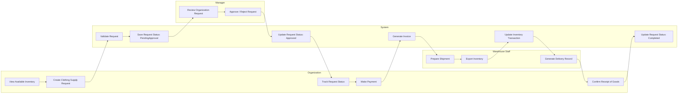

```mermaid
flowchart LR

subgraph Organization
    O1[View Available Inventory]
    O2[Create Clothing Supply Request]
    O3[Track Request Status]
    O4[Make Payment]
    O5[Confirm Receipt of Goods]
end

subgraph System
    S1[Validate Request]
    S2[Save Request Status: PendingApproval]
    S3[Update Request Status: Approved]
    S4[Generate Invoice]
    S5[Update Inventory Transaction]
    S6[Update Request Status: Completed]
end

subgraph Manager
    M1[Review Organization Request]
    M2[Approve / Reject Request]
end

subgraph WarehouseStaff[Warehouse Staff]
    W1[Prepare Shipment]
    W2[Export Inventory]
    W3[Generate Delivery Record]
end

O1 --> O2
O2 --> S1
S1 --> S2
S2 --> M1
M1 --> M2
M2 --> S3
S3 --> O3
O3 --> O4
O4 --> S4
S4 --> W1
W1 --> W2
W2 --> S5
S5 --> W3
W3 --> O5
O5 --> S6
```