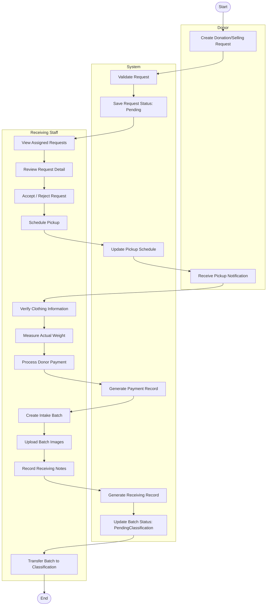

```mermaid
flowchart TD

Start([Start])

subgraph Donor
    D1[Create Donation/Selling Request]
    D2[Receive Pickup Notification]
end

subgraph System
    S1[Validate Request]
    S2[Save Request Status: Pending]
    S3[Update Pickup Schedule]
    S4[Generate Payment Record]
    S5[Generate Receiving Record]
    S6[Update Batch Status: PendingClassification]
end

subgraph ReceivingStaff[Receiving Staff]
    R1[View Assigned Requests]
    R2[Review Request Detail]
    R3[Accept / Reject Request]
    R4[Schedule Pickup]
    R5[Verify Clothing Information]
    R6[Measure Actual Weight]
    R7[Process Donor Payment]
    R8[Create Intake Batch]
    R9[Upload Batch Images]
    R10[Record Receiving Notes]
    R11[Transfer Batch to Classification]
end

End([End])

Start --> D1
D1 --> S1
S1 --> S2
S2 --> R1
R1 --> R2
R2 --> R3
R3 --> R4
R4 --> S3
S3 --> D2
D2 --> R5
R5 --> R6
R6 --> R7
R7 --> S4
S4 --> R8
R8 --> R9
R9 --> R10
R10 --> S5
S5 --> S6
S6 --> R11
R11 --> End
```