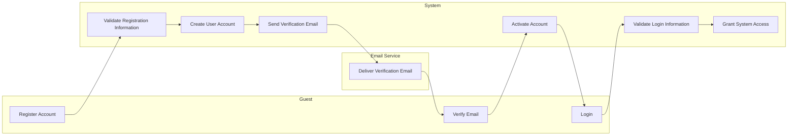

```mermaid
flowchart LR

subgraph Guest
    G1[Register Account]
    G2[Verify Email]
    G3[Login]
end

subgraph System
    S1[Validate Registration Information]
    S2[Create User Account]
    S3[Send Verification Email]
    S4[Activate Account]
    S5[Validate Login Information]
    S6[Grant System Access]
end

subgraph EmailService[Email Service]
    E1[Deliver Verification Email]
end

G1 --> S1
S1 --> S2
S2 --> S3
S3 --> E1
E1 --> G2
G2 --> S4
S4 --> G3
G3 --> S5
S5 --> S6
```