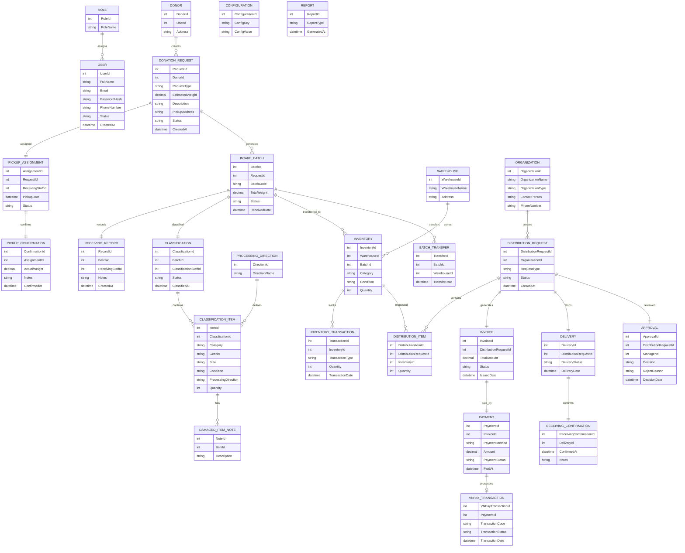

# Used Clothing Lifecycle Management System — Conceptual ERD

```mermaid
erDiagram

%% =========================
%% USER & ROLE MODULE
%% =========================

ROLE {
    int RoleId
    string RoleName
}

USER {
    int UserId
    string FullName
    string Email
    string PasswordHash
    string PhoneNumber
    string Status
    datetime CreatedAt
}

ROLE ||--o{ USER : assigns


%% =========================
%% DONOR FLOW
%% =========================

DONOR {
    int DonorId
    int UserId
    string Address
}

DONATION_REQUEST {
    int RequestId
    int DonorId
    string RequestType
    decimal EstimatedWeight
    string Description
    string PickupAddress
    string Status
    datetime CreatedAt
}

PICKUP_ASSIGNMENT {
    int AssignmentId
    int RequestId
    int ReceivingStaffId
    datetime PickupDate
    string Status
}

PICKUP_CONFIRMATION {
    int ConfirmationId
    int AssignmentId
    decimal ActualWeight
    string Notes
    datetime ConfirmedAt
}

DONOR ||--o{ DONATION_REQUEST : creates

DONATION_REQUEST ||--|| PICKUP_ASSIGNMENT : assigned

PICKUP_ASSIGNMENT ||--|| PICKUP_CONFIRMATION : confirms


%% =========================
%% RECEIVING & BATCH FLOW
%% =========================

INTAKE_BATCH {
    int BatchId
    int RequestId
    string BatchCode
    decimal TotalWeight
    string Status
    datetime ReceivedDate
}

RECEIVING_RECORD {
    int RecordId
    int BatchId
    int ReceivingStaffId
    string Notes
    datetime CreatedAt
}

DONATION_REQUEST ||--o{ INTAKE_BATCH : generates

INTAKE_BATCH ||--|| RECEIVING_RECORD : records


%% =========================
%% CLASSIFICATION FLOW
%% =========================

CLASSIFICATION {
    int ClassificationId
    int BatchId
    int ClassificationStaffId
    string Status
    datetime ClassifiedAt
}

CLASSIFICATION_ITEM {
    int ItemId
    int ClassificationId
    string Category
    string Gender
    string Size
    string Condition
    string ProcessingDirection
    int Quantity
}

DAMAGED_ITEM_NOTE {
    int NoteId
    int ItemId
    string Description
}

PROCESSING_DIRECTION {
    int DirectionId
    string DirectionName
}

INTAKE_BATCH ||--|| CLASSIFICATION : classified

CLASSIFICATION ||--o{ CLASSIFICATION_ITEM : contains

CLASSIFICATION_ITEM ||--o{ DAMAGED_ITEM_NOTE : has

PROCESSING_DIRECTION ||--o{ CLASSIFICATION_ITEM : defines


%% =========================
%% WAREHOUSE FLOW
%% =========================

WAREHOUSE {
    int WarehouseId
    string WarehouseName
    string Address
}

INVENTORY {
    int InventoryId
    int WarehouseId
    int BatchId
    string Category
    string Condition
    int Quantity
}

INVENTORY_TRANSACTION {
    int TransactionId
    int InventoryId
    string TransactionType
    int Quantity
    datetime TransactionDate
}

BATCH_TRANSFER {
    int TransferId
    int BatchId
    int WarehouseId
    datetime TransferDate
}

WAREHOUSE ||--o{ INVENTORY : stores

INTAKE_BATCH ||--o{ INVENTORY : transferred_to

INVENTORY ||--o{ INVENTORY_TRANSACTION : tracks

INTAKE_BATCH ||--o{ BATCH_TRANSFER : transfers


%% =========================
%% ORGANIZATION FLOW
%% =========================

ORGANIZATION {
    int OrganizationId
    string OrganizationName
    string OrganizationType
    string ContactPerson
    string PhoneNumber
}

DISTRIBUTION_REQUEST {
    int DistributionRequestId
    int OrganizationId
    string RequestType
    string Status
    datetime CreatedAt
}

DISTRIBUTION_ITEM {
    int DistributionItemId
    int DistributionRequestId
    int InventoryId
    int Quantity
}

ORGANIZATION ||--o{ DISTRIBUTION_REQUEST : creates

DISTRIBUTION_REQUEST ||--o{ DISTRIBUTION_ITEM : contains

INVENTORY ||--o{ DISTRIBUTION_ITEM : requested


%% =========================
%% PAYMENT FLOW
%% =========================

INVOICE {
    int InvoiceId
    int DistributionRequestId
    decimal TotalAmount
    string Status
    datetime IssuedDate
}

PAYMENT {
    int PaymentId
    int InvoiceId
    string PaymentMethod
    decimal Amount
    string PaymentStatus
    datetime PaidAt
}

VNPAY_TRANSACTION {
    int VNPayTransactionId
    int PaymentId
    string TransactionCode
    string TransactionStatus
    datetime TransactionDate
}

DISTRIBUTION_REQUEST ||--|| INVOICE : generates

INVOICE ||--|| PAYMENT : paid_by

PAYMENT ||--o| VNPAY_TRANSACTION : processes


%% =========================
%% DELIVERY FLOW
%% =========================

DELIVERY {
    int DeliveryId
    int DistributionRequestId
    string DeliveryStatus
    datetime DeliveryDate
}

RECEIVING_CONFIRMATION {
    int ReceivingConfirmationId
    int DeliveryId
    datetime ConfirmedAt
    string Notes
}

DISTRIBUTION_REQUEST ||--|| DELIVERY : ships

DELIVERY ||--|| RECEIVING_CONFIRMATION : confirms


%% =========================
%% MANAGER FLOW
%% =========================

APPROVAL {
    int ApprovalId
    int DistributionRequestId
    int ManagerId
    string Decision
    string RejectReason
    datetime DecisionDate
}

CONFIGURATION {
    int ConfigurationId
    string ConfigKey
    string ConfigValue
}

REPORT {
    int ReportId
    string ReportType
    datetime GeneratedAt
}

DISTRIBUTION_REQUEST ||--|| APPROVAL : reviewed

```